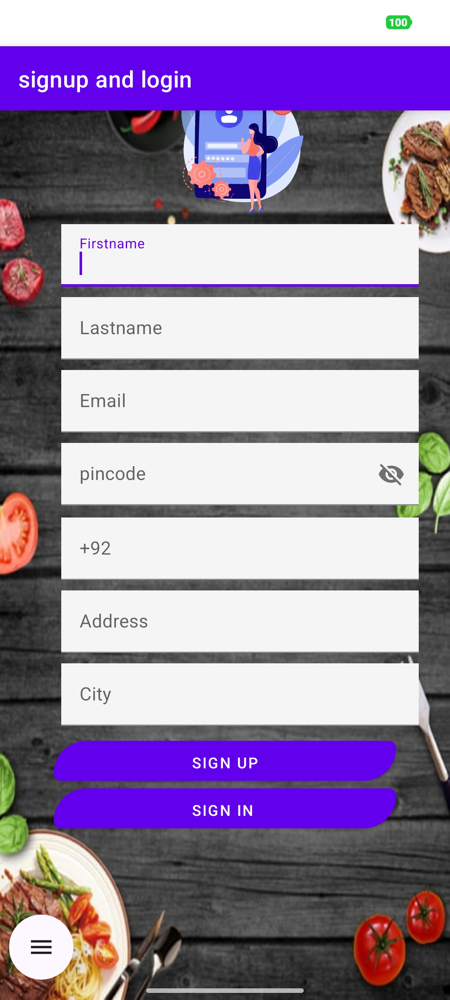
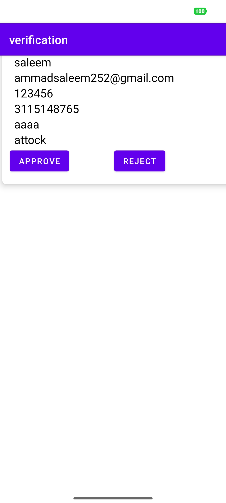
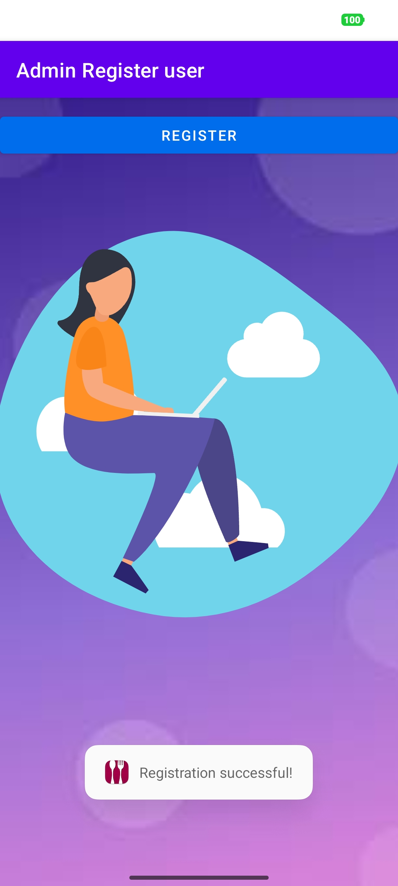
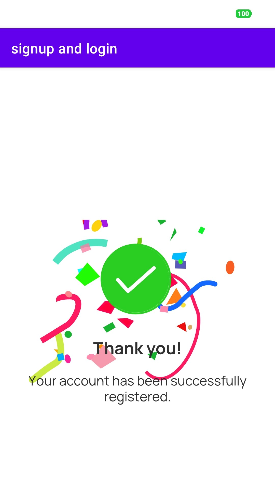

# FoodApp Delivery
Online Food Order & Delivery App is an Android-based system where the admin uploads dishes with images and details, and users can place Normal or Special orders. The application uses Firebase for real-time storage and management of user registration, authentication, and order data.
 
## Splash Screen
 

 

## **User Signup**

User can create an account using email and password. Validation ensures:

- Email format correct and not already registered  
- Password minimum 8 characters with letters & numbers  

 

 

## Signup Request to Admin
The user’s registration request is automatically sent to the admin panel.
Admin can view all newly registered users waiting for approval.
Admin reviews user details and approves the account.
Once approved, the user is allowed to log in to the app..
Once approved, a confirmation email is sent to the user. This email notifies the user that their account is now active and ready for login.
 

