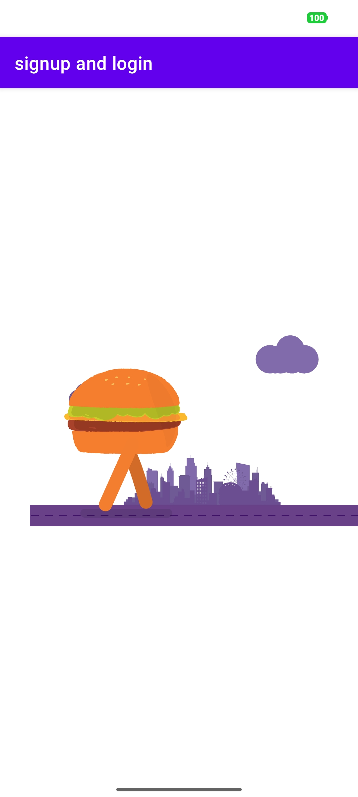

# FoodApp Delivery
Online Food Order & Delivery App is an Android-based system where the admin uploads dishes with images and details, and users can place Normal or Special orders. The application uses Firebase for real-time storage and management of user registration, authentication, and order data.
 
## Splash Screen
 

